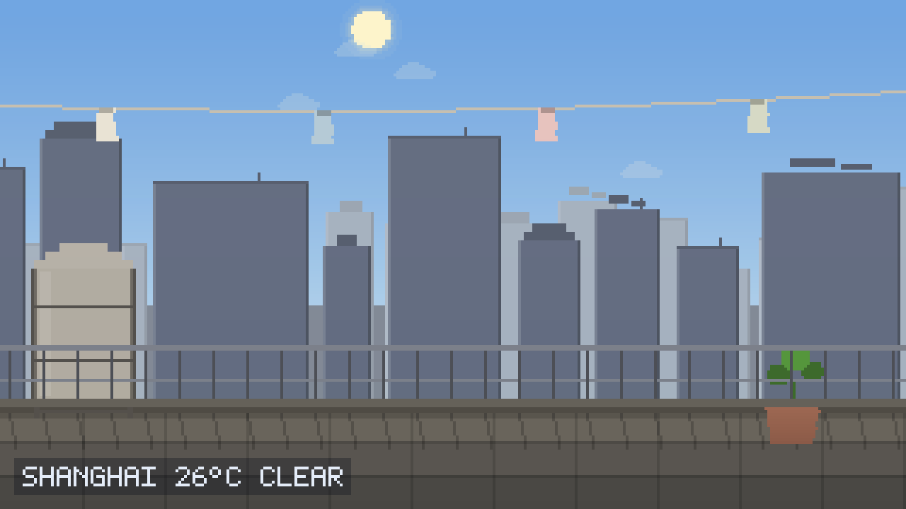
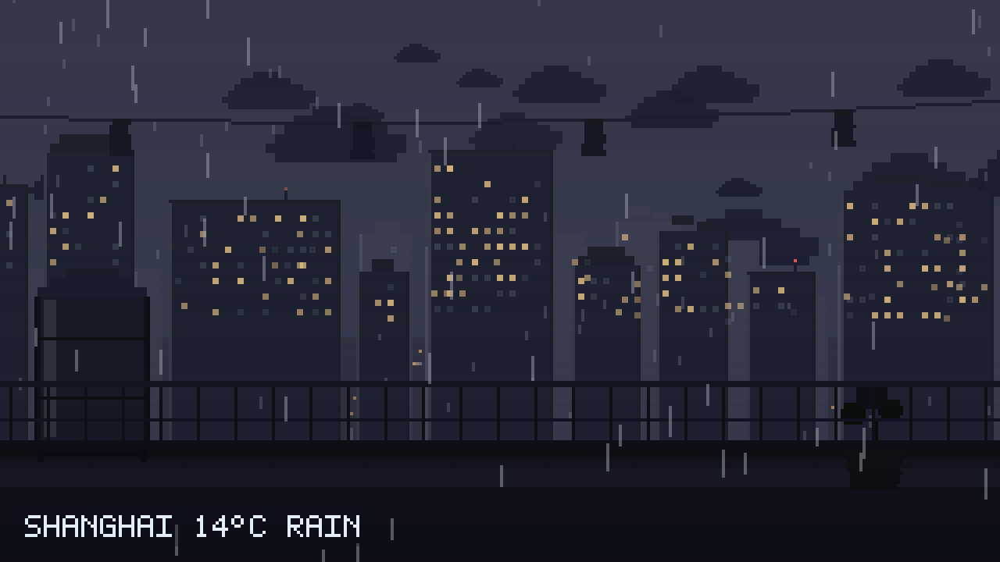

# 天台 · 一幅活着的天气画

一幅会根据你所在地**实时天气**和**真实时间**自动变化的像素风景画。

打开网页，看到的是城市天台的一角：远处高楼天际线，近处有水箱、晾衣绳和一盆绿植。天色在变、云在飘、衣角在摆；下雨时落雨，下雪时飘雪，起雾时远景被吃掉；晴天里栏杆的投影会随太阳方位慢慢偏移，夜里窗户次第亮起、月亮按真实月相盈亏。

没有按钮，没有交互。它自己活着。





## 它如何做到"活着"

画面由三条独立的时间线驱动，互不干扰：

| 时间线 | 来源 | 影响 |
|---|---|---|
| 天气 | Open-Meteo 实时接口，每 10 分钟刷新 | 云量、降水、降雪、雾、雷电、彩虹 |
| 天象 | 本地时间 + 你所在经纬度（NOAA 太阳位置算法） | 天色渐变、光照方向、星空、月相、季节 |
| 环境 | 帧循环内的连续函数 | 云飘移、衣物摆动、植被摇晃、车灯流动 |

三者叠加后，同一时刻的画面几乎不会重复。

## 特性

- **约 10 档天气**：晴 / 晴间多云 / 多云 / 阴 / 雾 / 毛毛雨 / 小雨·中雨·大雨 / 阵雨 / 雷雨 / 小雪·中雪·大雪 / 雨夹雪
- **逐小时与逐日预报**：轻触画面浮现未来 8 小时与未来 7 天，图标与画面用同一套像素语言
- **三级定位**：浏览器精确定位（可到几十米）→ IP 定位 → 时区推断，逐级降级，永不空白
- **真实昼夜**：按经纬度算太阳高度角与方位角，天色在 8 组关键帧之间连续插值，不是按钟点硬切
- **光影移动**：栏杆在地面的投影方向由太阳方位角决定，长度按太阳高度角的余切伸缩，午后影子会明显拉长并偏转
- **真实月相**：按朔望月周期（29.53 天）计算盈亏，用外缘圆与终止椭圆的交叠逐行求亮部
- **季节联动植被**：按月份判定季节，并按纬度自动翻转半球
- **天气过渡**：天气切换时不硬切，云量、降水、雾各自以不同速率平滑逼近
- **天气分级**：雨雪有强度差异，另有雷电闪光、雨后彩虹、地面积水反光与雨滴涟漪
- **环境微动**：云飘移、衣物摆动、植被摇晃、街道车灯流动、晴天有飞鸟掠过
- **游戏级像素美术**：每种材质 4 阶色板（高光/亮面/暗面/轮廓）+ 1px 深色轮廓线
- **自适应构图**：桌面横构图、手机自动切竖构图，且**像素颗粒在两种布局下保持一致**
- **零依赖**：原生 ES Module，不需要 `npm install`，不需要构建

## 怎么用

打开就是一幅画，不需要任何操作。只有两件事需要交互：

| 操作 | 作用 | 频率 |
|---|---|---|
| **首次打开** | 浏览器询问定位权限 → 允许即可获得精确天气 | 仅一次，浏览器会记住 |
| **轻触画面** | 浮现/收起未来 8 小时与未来 7 天预报 | 想看时 |
| **长按画面** | 手动输入城市名修正定位 | 定位异常时的自救入口 |

设计原则：**设置一次之后，日常使用不需要任何交互**。定位被运营商或公共 WiFi 带到别的城市时，长按输入城市名即可修正，之后一直沿用。

角落信息条的第二行会**实时显示太阳高度角、方位角与日出日落时间**（如 `SUN +61° AZ 201° 06:12-18:24`）。这几个数字由你所在经纬度与当前时刻直接解算而来，可以拿它对照手机自带的天气应用核验——这也是验证"画面里的光影确实跟着真实天文走"最直接的方式。

## 数据来源与隐私

| 用途 | 服务 | 说明 |
|---|---|---|
| 天气与预报 | [Open-Meteo](https://open-meteo.com/) | 免密钥、开放 CORS，一次请求取回当前 + 逐小时 + 逐日 |
| 精确位置 | 浏览器 Geolocation | 需授权一次，精度可到几十米；拒绝或失败时自动降级 |
| 粗略位置 | IP 定位（多源回退） | 依次尝试 `ipapi.co`、`ipwho.is`，手机蜂窝网络下可能偏到省会 |
| 城市名 | [BigDataCloud](https://www.bigdatacloud.com/) 反向地理编码 | 把坐标换成城市名，免密钥 |
| 城市搜索 | Open-Meteo Geocoding | 长按手动指定城市时使用 |
| 太阳/月亮位置 | 本地计算 | NOAA 近似算法，纯前端，不产生任何请求 |

不使用 Cookie，不采集任何用户数据。坐标只用于请求天气本身。

> **关于定位精度**：IP 定位的出口常落在运营商省会机房，手机端尤其明显——明明在上海却显示北京。所以精确定位以浏览器 Geolocation 为主路径，IP 只作兜底。

> 说明：太阳与月亮位置采用简化天文算法，精度在角分量级，对驱动一幅风景画而言完全足够，但不可用于天文观测。

## 本地运行

因为使用 ES Module，需要通过 HTTP 访问（直接双击 `index.html` 会被浏览器的模块 CORS 策略拦截）：

```bash
node serve.cjs
# 打开 http://localhost:8080/
```

或使用任意静态服务器：

```bash
npx serve .
python -m http.server 8080
```

## 部署到 GitHub Pages

整个仓库就是站点根目录，推送后在仓库 Settings → Pages 里选择 `main` 分支的 `/` 目录即可。

## 目录结构

```
index.html
styles.css
serve.cjs                 本地预览用静态服务器
src/
  main.js                 编排：时间线合成、刷新调度、环境构建
  core/
    canvas.js             像素舞台：逻辑分辨率随窗口比例自适应
    pixel.js              像素美术系统：材质四阶色板与带轮廓绘制原语
    math.js               插值、色彩混合、确定性随机、环境光染色
    sun.js                太阳/月亮位置、月相
    palette.js            天色关键帧与天气对天色的影响
  world/
    scene.js              图层编排与构图度量
    sky.js                天空色带、太阳、月亮、星空
    city.js               楼群生成、天际线、街道灯光
    roof.js               天台：地面、栏杆、水箱、盆栽、晾衣绳、投影
  fx/
    weather.js            云层、雨、雪、雾、雷电、彩虹、涟漪、飞鸟
  weather/
    api.js                三级定位、反向地理编码、城市搜索、天气请求
    codes.js              WMO 天气代码 → 画面参数
    state.js              目标值与显示值的平滑过渡
  ui/
    hud.js                自绘 5x7 点阵字模与角落信息条
    panel.js              程序化天气图标与轻触浮现的预报面板
shot/
  capture.cjs             无头浏览器多场景截图（开发用）
  verify-live.cjs         真实网络链路验证（开发用）
  verify-online.cjs       线上端到端验证（开发用）
```

## 实现要点

**像素颗粒一致性。** 逻辑分辨率不写死。横向构图固定 320 逻辑像素宽、竖向构图固定 190 宽，逻辑高度按窗口宽高比反推。这样像素颗粒在屏幕上的物理尺寸始终一致，画面又永远铺满不变形。

**天空的 banding。** 天空不是渐变填充，而是逐行取色堆出的 1 像素色带。相邻同色行会自动合并以减少绘制调用，既保留像素画特有的层次，又不浪费性能。

**环境光染色。** 所有物件基色都经 `lit(base, amb, light)` 处理：把基色放进当前环境光里映射。夜晚不是简单压黑，而是带冷色偏移，画面才不会变成一团死黑。

**天气是连续量。** 天气解码结果不是枚举，而是 `cloud / precip / snow / fog / thunder` 五个 0..1 的连续量。所以"雨停了"表现为云慢慢散、雨丝渐渐稀，而不是画面突然换一张。

## 调试接口

浏览器控制台可用 `window.__pixelWeather` 手动驱动画面，便于核对某个天气或时段：

```js
__pixelWeather.setWeather({ cloud: 0.9, precip: 0.8, snow: 0, fog: 0, thunder: 1, wind: 4, label: 'THUNDERSTORM' }, { temp: 23 });
__pixelWeather.setTimeOffsetMs(6 * 3600e3);  // 时间前移 6 小时
__pixelWeather.setPlace(35.68, 139.69, 'TOKYO');
__pixelWeather.state();
```
